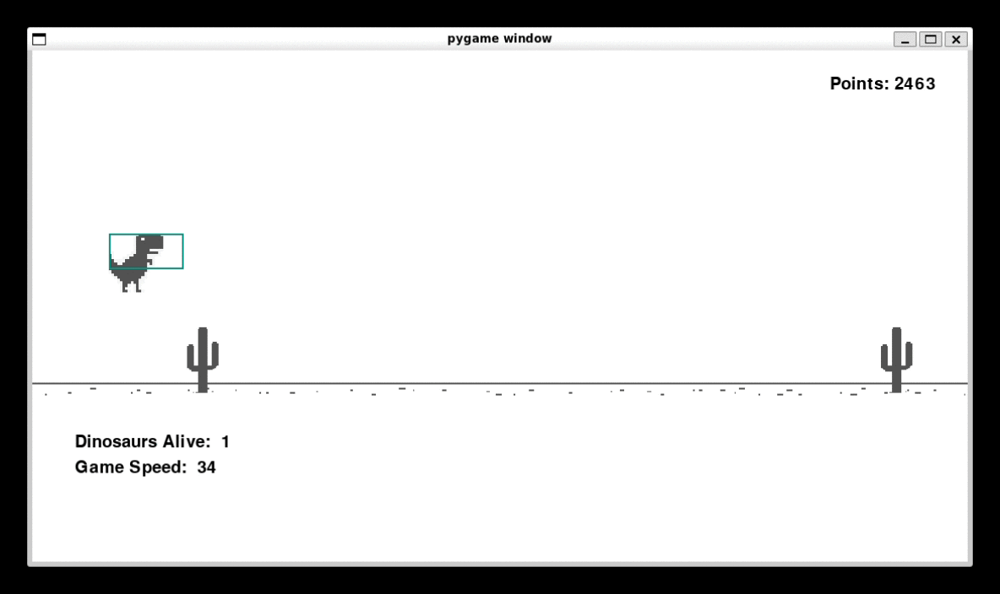

# Dino Game AI with Genetic Algorithm

<div align="center">
  
</div>

## Summary
- [Description](#description)
- [Usage Instructions](#usage-instructions)
  - [Installation](#installation)
  - [Execution](#execution)
- [Contact](#contact)

<div id="description"></div>

## 📝 Description
This project implements a neural network trained using a genetic algorithm from scratch to play Google's Dino Game. The network learns to make decisions (jump or duck) based on the obstacles appearing in the game. Training of the neural network is conducted using a genetic algorithm, where the network weights are optimized to maximize performance in the game over time.

<div id="usage-instructions"></div>

## 💻 Usage Instructions

<div id="installation"></div>

### Installation
Firstly, clone this repository:
```sh
git clone https://github.com/marlonmoratti/ChromeDinoGameAI.git
cd ChromeDinoGameAI
```

To run the scripts, you need to install some packages. We recommend using a virtual environment of your choice. In this guide, we will use venv. Make sure you have Python 3.10 installed. If you choose venv, follow these commands:
```sh
python3 -m venv venv
source venv/bin/activate
pip install -r requirements.txt
```

<div id="execution"></div>

### Execution
Finally, run the command below to train the network:
```sh
python3 main.py
```

At the end of the training, the network weights will be saved in the file [best_state.npy](results/best_state.npy), and tests can be conducted using the command below:
```sh
python3 main.py --load-state
```

If you want to perform a single test run with game rendering enabled, use the command below:
```sh
python3 main.py --load-state --render-game
```

For more information, run the command below:
```sh
python3 main.py --help
```

<div id="contact"></div>

## ✉️ Contact

If you have any questions or suggestions, feel free to open an issue or contact me directly.
